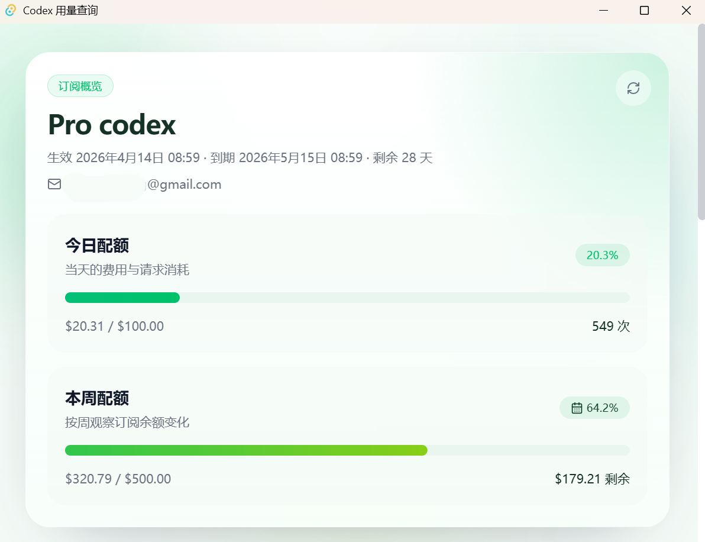

# yls_codex_usage

[](https://github.com/Yangless/yls_codex_usage/actions/workflows/ci.yml)
[](./LICENSE)

> 基于 `Tauri 2 + Vue 3 + Vite` 的桌面应用，用于查看 Codex 用量、订阅与余额，并在桌面端通过 `Tauri Stronghold` 安全保存 API key。

## 界面预览



## 项目亮点

- 安全保存 API key，应用重启后可重新加载
- 查询订阅、余额、今日用量与本周用量
- 支持手动刷新与定时轮询
- 后端返回 `msg` 时直接展示真实错误信息
- 新 key 先立即生效，再后台加密持久化，避免保存按钮长时间卡死
- 同一个 key 重复保存时跳过 Stronghold 写入

## 技术栈

- 前端：`Vue 3`、`Vite 6`、`Vitest`、`Tailwind CSS`、`shadcn-vue`、`lucide-vue-next`
- 桌面宿主：`Tauri 2`、`Rust`
- Tauri 插件：
  - `@tauri-apps/plugin-store` / `tauri-plugin-store`
  - `@tauri-apps/plugin-stronghold` / `tauri-plugin-stronghold`
  - `@tauri-apps/plugin-http` / `tauri-plugin-http`
  - `@tauri-apps/plugin-os` / `tauri-plugin-os`

## 平台支持矩阵

| 平台 | 状态 | 当前验证范围 | 说明 |
| --- | --- | --- | --- |
| Windows Desktop | 已验证 | `pnpm test`、`pnpm build`、`cargo check`、桌面端手工保存/刷新/重启读取 | 当前主要支持平台 |
| Linux Desktop | 已验证 | `pnpm test`、`pnpm build`、`cargo check`、`pnpm tauri dev` 启动、`pnpm tauri build`、手工保存/刷新/重启读取烟测 | 本地 `Ubuntu 24.04.3 LTS` + `WSLg` 已完成 |
| macOS Desktop | 已配置 Release CI | 基于 `v*` tag 的 GitHub Actions 多平台发布流程会自动构建并上传桌面产物到 GitHub Releases | 待首次工作流运行验证 |

## 快速开始

### 开发前提

在 Windows 上运行 Tauri 版本，需要准备：

- Node.js 20+
- `pnpm` 8.15.9
- Rust toolchain
- MSVC Build Tools

### 安装与检查

```bash
pnpm install
pnpm test
pnpm build
cargo check --manifest-path src-tauri/Cargo.toml
```

### 本地启动桌面应用

```bash
pnpm tauri dev
```

### 生产构建

```bash
pnpm build
pnpm tauri build
```

## 常用命令

| 命令 | 作用 |
| --- | --- |
| `pnpm test` | 运行前端测试 |
| `pnpm build` | 构建前端静态资源 |
| `cargo check --manifest-path src-tauri/Cargo.toml` | 检查 Tauri/Rust 宿主代码 |
| `pnpm tauri dev` | 启动本地桌面开发环境 |
| `pnpm tauri build` | 打包桌面应用 |

## 安全与本地存储

Tauri 桌面端已经不再使用 `localStorage` 保存密钥。

- 密钥不会提交到后端配置文件，也不会写入浏览器 `localStorage`
- 密钥在运行时先进入应用内存，用于立即发起查询
- 持久化时，密钥会以 `Tauri Stronghold` 加密仓库形式保存在本机磁盘
- 刷新频率保存在 Tauri Store

当前实现位置：

- Stronghold 宿主初始化：`src-tauri/src/lib.rs`
- Tauri 端存储实现：`src/platform/tauri/storage.tauri.ts`
- 平台注入入口：`src/platform/index.ts`

Windows 下默认本地文件位置：

- 设置：`%APPDATA%\com.ylsagi.codexusage\settings.json`
- 密钥仓库：`%APPDATA%\com.ylsagi.codexusage\vault.hold`

更多安全信息见 [`SECURITY.md`](./SECURITY.md)。

## 架构概览

- `src/features/codex-usage`：用量查询业务逻辑、轮询、错误处理、测试
- `src/platform`：平台契约与 `web/tauri` 适配层
- `src-tauri`：Tauri 宿主、权限配置和 Rust 初始化
- `src/components`：页面组件与基础 UI 组件

## 当前验证说明

### Windows Desktop

已验证：

- `pnpm test`
- `pnpm build`
- `cargo check --manifest-path src-tauri/Cargo.toml`
- Tauri 桌面端手工保存/刷新/重启读取

### Linux Desktop

已验证：

- `Ubuntu 24.04.3 LTS`
- `pnpm test`
- `pnpm build`
- `cargo check --manifest-path src-tauri/Cargo.toml`
- `pnpm tauri build`
- `pnpm tauri dev` 启动，并观察到 `vite`、`cargo run` 与 `./yls_codex_usage` 进程启动
- 直接启动 `src-tauri/target/release/yls_codex_usage`
- 焦点切换后窗口仍能持续渲染内容
- Linux 运行时会自动降级玻璃模糊/透明滤镜，以规避 WebKitGTK 白屏重绘问题
- 根字体链显式包含 `Noto Sans CJK SC`，减少中文字体 fallback 混乱
- 手工保存无效 key 后，界面展示了后端返回的无效 key 错误
- Linux 存储路径已确认在 `~/.local/share/com.ylsagi.codexusage/`
- Linux `vault.hold` 备份与恢复已完成一次实操校验
- Linux 手工业务烟测已完成：
  - 保存有效 key
  - 保存无效 key
  - 重启后读取已保存配置
  - 其中有效 key 的最终通过状态由用户人工确认

- 当前已知限制：
  - 默认 Wayland 路径下仍伴随 `libEGL/MESA` 警告

## 项目文档

- [`CONTRIBUTING.md`](./CONTRIBUTING.md) — 贡献流程与提交要求
- [`SECURITY.md`](./SECURITY.md) — 安全问题报告方式与边界说明
- [`CHANGELOG.md`](./CHANGELOG.md) — 版本变更记录
- [`CODE_OF_CONDUCT.md`](./CODE_OF_CONDUCT.md) — 社区行为准则
- [`docs/repository-settings.md`](./docs/repository-settings.md) — GitHub 仓库设置建议、topics、labels 与分支保护建议

## Roadmap

- GitHub Releases：推送 `v*` tag 后自动构建并上传 Windows、Linux、macOS 桌面产物

## License

本项目基于 [MIT License](./LICENSE) 开源。
